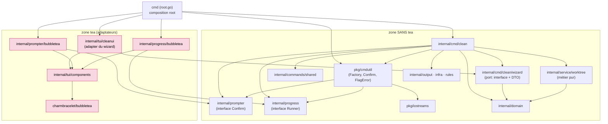
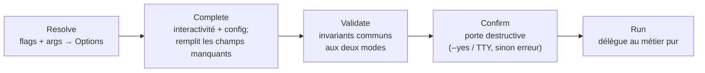
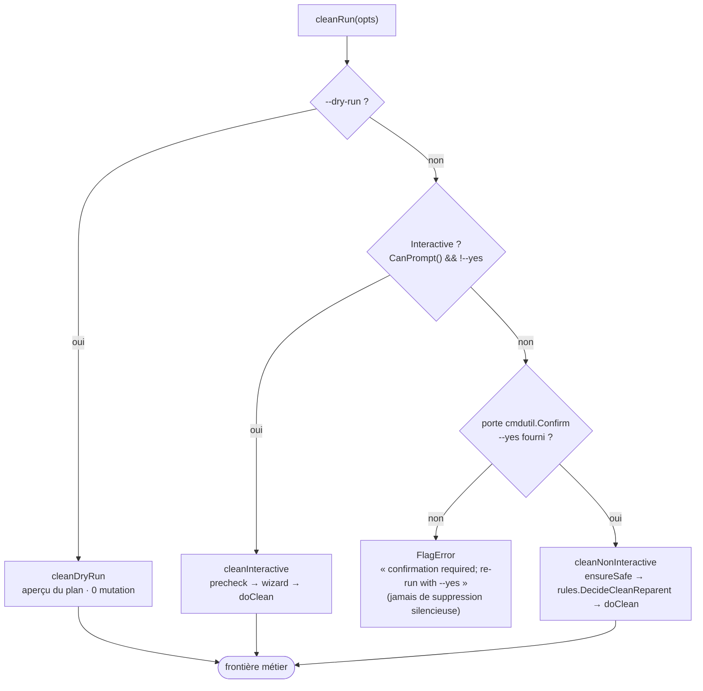

# Feature `clean` — diagrammes

Principe : **un diagramme = une question + un niveau de zoom**. On ne mélange jamais la
**structure** (statique : qui dépend de qui) et le **comportement** (runtime : que se passe-t-il).
Chaque diagramme a **une seule sémantique de flèche**, annoncée en tête.

> `clean` est le 1er pilote de l'architecture Command / Options / Run + Factory
> (voir [`MIGRATION_GUIDE_COMMAND_FACTORY.md`](./MIGRATION_GUIDE_COMMAND_FACTORY.md)).

---

## Diagramme 1 — Dépendances & membrane (statique)

**Question : qui importe qui ?** C'est le diagramme canonique : il encode l'invariant
d'architecture. **Flèche = « importe / dépend de ».** Nœuds = **paquets** (jamais de fonctions ;
les helpers disparaissent dans leur boîte).

**Invariant** : aucune flèche ne part de `internal/cmd/*` vers la zone tea. La commande n'atteint
le comportement tea qu'à travers des **abstractions** (le port `wizard`, les interfaces `prompter`
/ `progress`) que les **adaptateurs** implémentent. Seul le *composition root* (`cmd`) nomme les
deux côtés.



Vérification de l'invariant :

```bash
grep -rl "charmbracelet/bubbletea" internal/cmd   # → vide (y compris le port wizard/)
```

---

## Diagramme 2 — Cycle de vie (le patron, comportemental)

**Question : quelles phases traverse une commande ?** **Générique, non spécifique à clean** —
c'est le pattern lui-même, réutilisable pour toute commande future. **Flèche = « puis ».** Linéaire
donc lisible par construction.



- **Resolve/Complete/Validate/Run** = le squelette identique de chaque commande.
- **Confirm** s'insère entre Validate et Run pour les commandes destructives (factorisé dans
  `cmdutil.Confirm`).
- En test, `runF` s'injecte entre Validate et Run (capture des Options, sans exécuter le métier).

---

## Diagramme 3 — Aiguillage de `clean` (contrôle, comportemental)

**Question : selon quels critères clean choisit son mode ?** L'arbre de décision des trois modes.
**Flèche = « flux de contrôle ».** Il **s'arrête à la frontière du métier** : on n'entre pas dans
`worktree.*` (c'est un autre zoom — voir diagramme 4).



> En amont, `validateOptions` a déjà rejeté les cas incohérents (branche manquante hors
> interactif → `ErrCleanBranchRequired` ; `--output json` sans `--yes`/`--dry-run` → `FlagError`).

---

## Diagramme 4 (optionnel, zoom-in) — l'intérieur de `doClean`

**Question : que fait concrètement la suppression ?** Zoom sur **un seul mode**. Gardé à part,
**jamais fusionné dans le diagramme 3**. **Flèche = « flux de contrôle ».**

```mermaid
flowchart TD
    D0["doClean(opts, params, plan, applyReparent)"] --> D1["shared.StopWorktreeServices<br/>(socket daemon)"]
    D1 --> D2["worktree.Clean<br/>(remove worktree + delete branch)"]
    D2 --> Q{"résultat ?"}
    Q -->|ErrWorktreeNotFound| IDEM["idempotent<br/>'already absent' / JSON already_absent"]
    Q -->|ErrCannotCleanParent| WARN["warning : parent non supprimable"]
    Q -->|ok| D3["si on supprime le cwd → shared.RedirectToBase (WTM_GO_FILE)"]
    D3 --> D4["applyChildReparent<br/>(si applyReparent : réécrit meta.json des enfants)"]
    D4 --> D5{"--output json ?"}
    D5 -->|oui| J["WriteWorktreeCleanJSON"]
    D5 -->|non| F["Frame : Success + lignes reparented / orphaned"]
```


