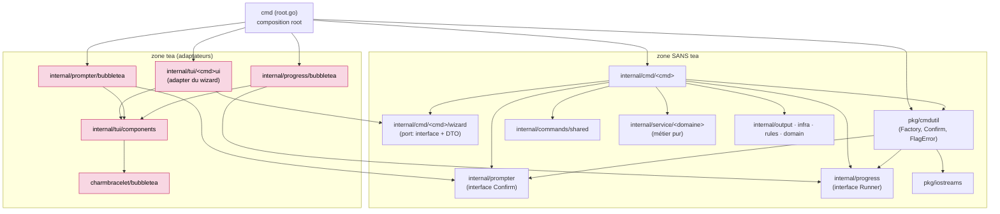
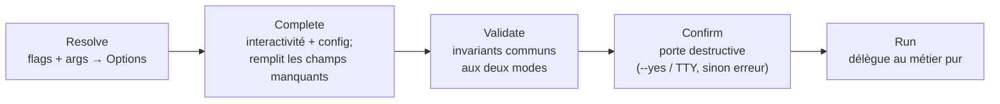

# Architecture des commandes wtm — Command / Options / Run + Factory

> **Référence concrète**, tirée du pilote réel **`clean`** (branche `refactor/command-factory`).
> Objectif : servir de patron pour migrer la commande suivante. Tout ce qui est décrit ici
> **existe dans le code** — les chemins renvoient aux fichiers vivants.
>
> Pour les schémas de flux détaillés de `clean`, voir [`CLEAN_FEATURE_FLOW.md`](./CLEAN_FEATURE_FLOW.md).

Inspiré de la GitHub CLI (`gh`), **adapté à wtm** : une commande n'est qu'un **adaptateur**, pas un
service. Elle déclare des flags, les range dans une struct typée, valide, puis délègue au métier pur.

---

## 0. État du pilote & ce qu'on réutilise

Le pilote **`clean` est fait**.

**Stratégie réelle : socle neuf + réutilisation du métier existant** (pas un « greenfield qui réécrit
tout »). On a posé un socle transverse neuf, mais on **réutilise tel quel** ce qui était déjà propre :

| Réutilisé tel quel | Posé comme socle neuf (réutilisable) |
|---|---|
| `internal/service/worktree` (métier pur) | `pkg/iostreams` (IOStreams) |
| `internal/tui/components` (primitives TUI) | `pkg/cmdutil` (Factory, FlagError, Confirm) |
| `internal/output` (rendu + JSON) | `internal/prompter` (input générique) |
| `internal/domain` (types/erreurs/constantes) | `internal/progress` (feedback sortie) |
| `internal/rules` (fonctions pures) | ports wizard `internal/cmd/<cmd>/wizard` |
| `internal/commands/shared` (support commande) | |

---

## 1. Vue d'ensemble — dépendances & membrane (statique)

**Une seule sémantique : « importe / dépend de ». Nœuds = paquets.**

**Invariant** : **aucun paquet sous `internal/cmd/` n'importe `tea`.** La commande n'atteint le
comportement tea qu'à travers des **abstractions** (le port `wizard`, les interfaces `prompter` /
`progress`) que des **adaptateurs** implémentent. Seul le *composition root* (`cmd`) nomme les deux côtés.



Vérification (doit être vide) :

```bash
grep -rl "charmbracelet/bubbletea" internal/cmd
```

---

## 2. Le socle transverse (posé une fois)

### 2.1 IOStreams — `pkg/iostreams/iostreams.go`

Toute E/S passe par `IOStreams{In, Out, ErrOut}` + l'état TTY. **Jamais** d'écriture directe sur
`os.Stdout` depuis une commande.

- `System()` — streams réels (prod). `Test()` / `TestInteractive()` — buffers mémoire, non-TTY / TTY forcé.
- `CanPrompt()` = **`!neverPrompt && stdinIsTTY`**. ⚠ **Gate sur stdin uniquement** (pas stdin+stdout
  comme `gh`) : wtm pipe souvent stdout via le bridge shell (`WTM_GO_FILE`) tout en gardant stdin TTY.
  `ErrIsTTY()` est exposé car les wizards rendent sur stderr.

### 2.2 Factory — `pkg/cmdutil/factory.go`

Conteneur d'injection construit **une fois** au root, passé à chaque `NewCmdXxx` :

```go
type Factory struct {
    IOStreams *iostreams.IOStreams
    Prompter  prompter.Prompter   // INPUT générique
    Progress  progress.Runner     // feedback SORTIE
    Config    func(dir string) (shared.ConfigResult, error)
}
```

`FlagError` / `FlagErrorf(...)` : marque une erreur d'**usage** (le root affiche l'usage + exit code
`ExitCodeUsage`, voir §8).

### 2.3 Prompter — `internal/prompter` (INPUT générique)

**Uniquement les primitives d'interaction génériques** (celles que ≥2 commandes utilisent). Aujourd'hui :

```go
type Prompter interface {
    Confirm(prompt string, defaultYes bool) (bool, error)
}
```

Implémentation : `internal/prompter/bubbletea`. **Interdit** : un flow spécifique à une commande
(un wizard) — voir §6. Critère d'admission dans ce paquet : au moins deux commandes en ont besoin.

### 2.4 Progress — `internal/progress` (feedback SORTIE, capacité sœur)

Le **spinner n'est pas un Prompter** : il *anime une sortie*, il ne *sollicite jamais l'utilisateur*
(ségrégation d'interface). Il vit donc à part :

```go
type Runner interface {
    Run(params RunParams, work func() error) error // RunParams{Message, Animate}
}
```

Implémentation : `internal/progress/bubbletea` (enveloppe `components.RunLoading`). Un helper
d'orchestration qui affiche « Checking… / Cleaning… » pendant un appel métier lent utilise `Progress`,
pas `Prompter`.

### 2.5 La porte de confirmation — `pkg/cmdutil/confirm.go`

Le **seul** endroit qui porte la règle « jamais de destruction silencieuse » :

```go
func Confirm(p ConfirmParams) error {
    if p.Yes { return nil }                                   // --yes : pré-confirmé
    if !p.IO.CanPrompt() {                                    // non-interactif sans --yes :
        return FlagErrorf("confirmation required to proceed; re-run with --yes")  //  → ERREUR
    }
    ok, err := p.Prompter.Confirm(p.Prompt, false)            // [y/N] défaut Non (Entrée annule)
    if err != nil { return err }
    if !ok { return domain.ErrUserAborted }
    return nil
}
```

---

## 3. La commande = triptyque (Pattern A)

Trois artefacts par commande, dans `internal/cmd/<cmd>/` (réf. `internal/cmd/clean/`) :

- **`NewCmdXxx(f *cmdutil.Factory, [ports…], runF func(*XxxOptions) error) *cobra.Command`** — câblage
  seul : déclare les flags (via `domain.Flag*`), branche le `RunE`. **Zéro métier.** Les ports (ex. le
  `wizard.Wizard`) sont injectés en paramètre.
- **`XxxOptions`** — le contrat unique. Dépendances (`IO`, `Prompter`, `Progress`, ports, `Config`) +
  un champ typé par flag + l'état résolu (`Interactive`, config chargée…).
- **`xxxRun(opts)`** — lit **uniquement** `opts`. Aiguille et délègue au métier via une **struct de
  params dédiée** (`domain.CleanParams`), jamais `Options` (qui traîne `IO`/`Prompter`).

**`runF`** est le point d'injection des tests : `nil` en prod (le vrai `xxxRun`), une closure qui
capture les `Options` en test.

Réf. : `internal/cmd/clean/clean.go` (`NewCmdClean`, `completeOptions`, `validateOptions`),
`clean_run.go` (`cleanRun` + les 3 modes + `cleanParamsFor`), `clean_helpers.go` (orchestration).

---

## 4. Le cycle de vie (comportemental, générique)

**Flèche = « puis ». Générique, réutilisable pour toute commande.**



- **Resolve** : cobra parse flags + arg positionnel → `Options`.
- **Complete** : `opts.Interactive = IO.CanPrompt() && !opts.Yes` ; charge la config **une fois**
  (`f.Config(getwd)`) ; résout ce qui a un défaut (`shared.ResolveBase`). Ne prompte pas champ par
  champ si la collecte interactive est un **wizard** (voir §6).
- **Validate** : filet commun aux deux modes (garde JSON, sélection requise hors collecte interactive
  → `FlagError` / sentinelle `domain.Err…`).
- **Confirm** : s'insère entre Validate et Run pour le destructif, **factorisé** dans `cmdutil.Confirm`.
- **Run** : métier pur, agnostique de la provenance des valeurs.
- **Dispatch test** : `if runF != nil { return runF(opts) }` avant le vrai `xxxRun`.

---

## 5. Les deux axes de bypass + `--dry-run` (OBLIGATOIRE)

Modèle standardisé (aligné `gcloud --quiet`, `terraform -input=false`, clig.dev). Toute commande
mutante l'expose **exactement**.

- **`--force` = valeur métier.** Il ne demande pas « es-tu sûr ? », il **change ce que fait la
  commande** (lever un garde-fou : supprimer un worktree dirty/unpushed/open-PR). Il descend au métier
  comme champ de `Params`. Pour un booléen dont le zéro est légitime, `cmd.Flags().Changed("force")`.
- **`--yes` / `-y` = porte de confirmation + mode non-interactif complet.** Via le fold
  `Interactive = CanPrompt() && !Yes`, `--yes` **éteint tout le mode interactif** (collecte comprise) :
  `wtm clean --yes` **sans branche** → erreur (pas de picker). Défaut de prompt `[y/N]`, Entrée annule.
- **Non négociable** : non-interactif **sans `--yes`** sur une action destructrice → **erreur**, jamais
  de suppression silencieuse. C'est `cmdutil.Confirm` qui l'applique (§2.5).
- **`--dry-run` = champ métier compagnon.** Court-circuite la porte, **affiche ce qui serait fait**,
  aucune mutation. Ne requiert ni `--yes` ni TTY. ⚠ **Le dry-run est intrinsèquement non-interactif**
  (il n'ouvre jamais le picker) → il **exige une branche explicite**. Le bon garde est :
  `branche requise sauf en collecte interactive réelle`, soit `Interactive && !DryRun`.

Câblage : `interactive := isTTY && rules.IsHumanFormat(format) && !yes`, chaque picker/prompt gate
dessus ; chaque sélection requise → sentinelle `domain.Err…Required` quand il est faux. JSON exige
`--yes` (ou `--dry-run`, non-destructif). Réf. : `internal/cmd/clean/clean.go` `validateOptions`.

---

## 6. TUI riche = ports & adapters (le cas wizard)

Un **wizard composite** (multi-étapes) n'est **pas** une méthode sur `Prompter` (ce serait un flow
spécifique dans un paquet générique). C'est un **port** défini à côté de la commande, satisfait par un
**adaptateur** tea, injecté au root :

```
internal/cmd/<cmd>/wizard/wizard.go   # PORT : interface Wizard { Run(Prompt) (Choice, error) } + DTO
                                      #   feuille (importe seulement domain)
internal/tui/<cmd>ui/adapter.go       # ADAPTER : NewWizard(io) satisfait le port, mappe
                                      #   domain.ErrUserAborted → Choice{Aborted:true} ; importe tea
internal/cmd/<cmd>/<cmd>.go           # NewCmdXxx(f, w wizard.Wizard, runF)
cmd/root.go                           # injection : NewCmdXxx(f, <cmd>ui.NewWizard(f.IOStreams), nil)
```

- La commande dépend du **port** (domain-only) + des interfaces génériques → **jamais** de tea.
- L'adaptateur reçoit les données métier via des **closures** (`Check`, `ReparentPreview`) : il
  n'importe pas `service`.
- Le paquet TUI et son dossier portent le **même nom** (`<cmd>ui`) pour éviter tout alias d'import.

Réf. : `internal/cmd/clean/wizard/wizard.go`, `internal/tui/cleanui/adapter.go`,
`internal/tui/cleanui/wizard.go` (le `RunWizard` bubbletea réutilisé). Le patron des wizards
multi-étapes (breadcrumb, back-nav, recap) est documenté dans le skill `go-cli`.

---

## 7. Où ranger quoi (rangement des helpers)

| Nature | Emplacement | Exemple clean |
|---|---|---|
| **Fonction pure** (no I/O : décision, classification, transform) | `internal/rules/<cmd>.go` | `rules.CleanUnsafeReason`, `rules.DecideCleanReparent`, `rules.CleanReparentPreview/OrphanedChildren` |
| **Métier impur** (git, FS, hooks) | `internal/service/<domaine>` | `worktree.Check/Clean/PlanCleanReparent/ApplyReparentChildren` |
| **Helper I/O partagé** entre commandes | `internal/commands/shared` | `shared.RedirectToBase/ResolveSymlinks/StopWorktreeServices`, `shared.ResolveBase`, `shared.LoadConfigDir` |
| **Orchestration** (spinner + service + output) | couche commande `internal/cmd/<cmd>` | `precheckClean`, `ensureSafeToClean`, `doClean` |
| **Rendu / JSON** | `internal/output` | `output.WriteWorktreeCleanJSON`, `output.Frame/Success/Warning` |

Règle d'or : **le métier reçoit `Params` déjà résolus, jamais la logique de résolution**
(`shared.ResolveBase` fait `override > config > auto-détection`, `worktree.*` ne reçoit qu'un
`BaseBranch` résolu). Config : `shared.LoadConfigDir(dir)` (sans cobra) via `Factory.Config`.

---

## 8. Câblage root (bridge minimal) + gestion d'erreurs — `cmd/root.go`

wtm garde son `var rootCmd` global (bridge minimal, pas de refactor root complet dans le pilote) :

- `buildFactory()` construit `IOStreams.System()` + adaptateurs bubbletea + `Config`.
- La commande est enregistrée **dans `init()`** (pas seulement dans `Execute`) pour que le générateur
  de docs (`tools/gendocs`, qui parcourt `Root()` sans appeler `Execute`) la voie.
- `Execute()` utilise `cmd, err := rootCmd.ExecuteC()` et :
  - `errors.As(err, &cmdutil.FlagError{})` → imprime `cmd.UsageString()` + exit `ExitCodeUsage`
    (c'est ce qui rend `FlagErrorf` utile) ;
  - `domain.ErrAborted` / `domain.ErrUserAborted` → sortie **propre** (pas de stack alarmante).

---

## 9. Tests — `internal/cmd/<cmd>/<cmd>_test.go`

Sans vrai terminal, grâce à `runF` + streams mémoire + mocks :

- Dépendances mockées : `iostreams.Test()` / `TestInteractive()`, un `mockPrompter` (Confirm), un
  `stubProgress` (Run exécute le work), un `mockWizard` (capture le `Prompt`, renvoie un `Choice`).
- **Familles à couvrir** :
  1. **Résolution des flags** : `runF` capture les `Options` → asserte les champs + `Interactive`.
  2. **Porte non-interactive** : sans TTY, sans `--yes` → `FlagError` (« confirmation required »),
     wizard **jamais** appelé ; sélection requise manquante → sentinelle `domain.Err…`.
  3. **`--yes` = non-interactif complet** : `--yes` sans sélection → sentinelle (pas de picker).
  4. **`--dry-run`** : aperçu, métier **jamais** muté ; requiert une sélection explicite (TTY + pipe).
  5. **Interactif mocké** : le wizard reçoit le bon `Prompt` (presets, closures non-nil), son `Choice`
     est consommé.

Réf. : `internal/cmd/clean/clean_test.go`. Les tests métier (`service/*`, `rules/*`) restent à part.

---

## 10. Viper / précédence multi-source — N/A pour wtm

wtm **n'adopte pas Viper**. Il a déjà une source de vérité **plus forte** : un TOML **strict typé**
(`internal/config` `decodeStrict`, `#:schema`, structs validées) que Viper — permissif, non typé
(`GetString`/`GetBool` → `interface{}`) — affaiblirait. Les `os.Getenv`
(`WTM_PROJECT_DIR`/`WTM_STATE_DIR`/`WTM_GO_FILE`/`EDITOR`/`SHELL`) sont des escape-hatches de boundary,
**pas** une précédence multi-source. Le seul vrai besoin (`shared.ResolveBase :
override > config > auto-détection git`) est local, déjà résolu, et son 4ᵉ niveau (auto-détection)
n'est **même pas** modélisable par Viper. De plus `AutomaticEnv` rendrait `--force`/`--yes` pilotables
par env (dangereux) et tirerait le refactor root différé. → **Les migrations suivantes ignorent ce
pattern.** Réversible si un vrai besoin de précédence `flag > env > config` apparaît.

---

## 11. Checklist de migration, par commande

- [ ] Dossier `internal/cmd/<cmd>/` : `<cmd>.go`, `<cmd>_run.go`, (`<cmd>_helpers.go` si besoin), `<cmd>_test.go`.
- [ ] `XxxOptions` : `IO`/`Prompter`/`Progress`/ports/`Config` + un champ par flag (constantes `domain.Flag*`) + état résolu.
- [ ] `NewCmdXxx(f, [ports], runF)` : flags + wiring `RunE` seulement. Zéro métier. `GroupID` posé.
- [ ] `RunE` suit **Resolve → Complete → Validate → (Confirm) → Dispatch**.
- [ ] Mutation destructive → **deux axes** `--force`/`--yes` + `--dry-run` (§5) ; `cmdutil.Confirm` porte la garde.
- [ ] Collecte interactive = **wizard port** (`internal/cmd/<cmd>/wizard` + adapter `internal/tui/<cmd>ui`), injecté au root. Aucun import tea sous `internal/cmd`.
- [ ] `xxxRun` lit `opts`, appelle le métier via une struct `Params` dédiée. Métier réutilisé (`service/*`).
- [ ] Fonctions pures → `internal/rules/<cmd>.go`. Helpers I/O partagés → `internal/commands/shared`. Aucune duplication.
- [ ] Aucune écriture directe sur `os.Stdout` : tout via `opts.IO.Out/ErrOut`. Framing via `output.Frame` (jamais en JSON).
- [ ] Enregistrement dans `cmd/root.go` `init()` (docs le voient) + gestion `FlagError`/abort dans `Execute`.
- [ ] Tests des 5 familles (§9), sans vrai terminal.
- [ ] `make docs` régénéré + skill agent (`using-wtm.skill.md`) + README si la surface CLI change.
- [ ] `build-validator` : `go build`, `vet`, `staticcheck`, `go test ./...` verts.

---

## 12. Critères go / no-go du pilote

Le pilote `clean` valide déjà :

- Même `--flag` → résultat **identique** en interactif et non-interactif (le mode ne change que la
  *collecte*, pas le *résultat*).
- Ajouter un flag ne touche que `Options` + une ligne de déclaration (+ éventuellement un bloc de
  collecte/validation) — **jamais** le métier.
- `go test ./internal/cmd/...` couvre les familles **sans** vrai terminal.
- `grep -rl "charmbracelet/bubbletea" internal/cmd` est **vide**.
- Le métier compile et se teste **sans** cobra/bubbletea.

---

## 13. Références

- **GitHub CLI (`gh`)** — patron `NewCmdFoo(f, runF)` / `Options` / `fooRun`, Factory, `internal/prompter` :
  https://github.com/cli/cli/blob/trunk/AGENTS.md · `pkg/cmd/issue/list/list.go` ·
  https://pkg.go.dev/github.com/cli/cli/v2/pkg/cmdutil
- **Cobra** — DI, composition root, `RunE`, gestion d'erreurs : https://cobra.dev/docs/explanations/enterprise-guide/
- **Bubbletea / Charm** (confiné derrière les adaptateurs) : https://github.com/charmbracelet/bubbletea ·
  `huh` (alternative de formulaires) : https://pkg.go.dev/charm.land/huh/v2
- **Détection TTY** — `golang.org/x/term` (`IsTerminal`) : https://pkg.go.dev/golang.org/x/term

> Viper est volontairement **hors périmètre** (§10).

---

## 14. Résumé en une phrase

Une commande wtm est un **adaptateur** : elle remplit une struct `Options` (flags, puis — si collecte
interactive réelle — un **wizard** injecté via un port), la **valide**, passe la **porte de
confirmation** destructive (`cmdutil.Confirm`), puis délègue à une **fonction métier pure** via une
struct `Params` — le tout câblé par une **Factory** unique, avec `tea` confiné aux adaptateurs.
