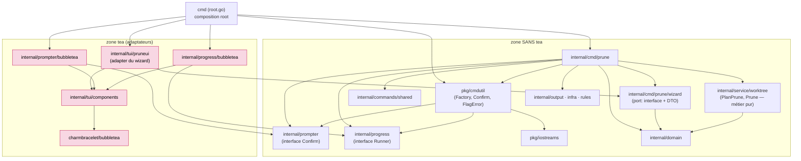
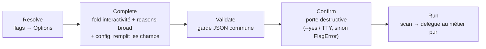
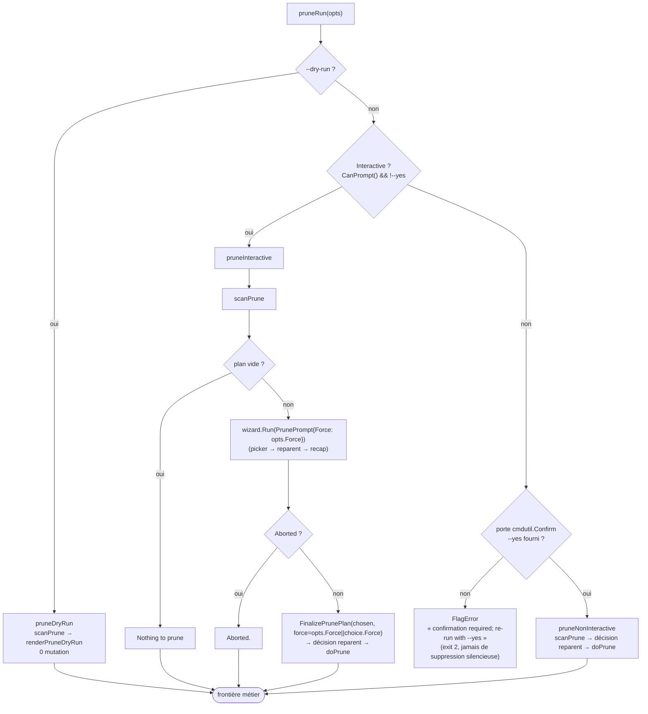
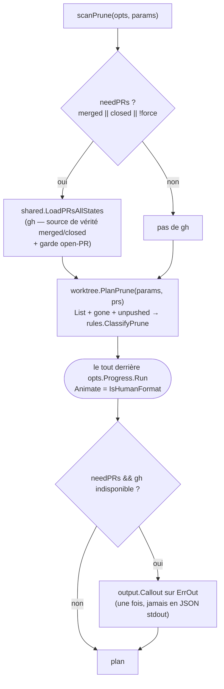
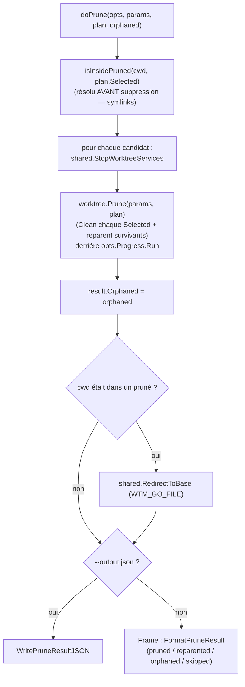

# Feature `prune` — diagrammes

Principe : **un diagramme = une question + un niveau de zoom**. On ne mélange jamais la
**structure** (statique : qui dépend de qui) et le **comportement** (runtime : que se passe-t-il).
Chaque diagramme a **une seule sémantique de flèche**, annoncée en tête.

> `prune` est la **2ᵉ commande** de l'architecture Command / Options / Run + Factory (après le
> pilote `clean`), voir [`MIGRATION_GUIDE_COMMAND_FACTORY.md`](./MIGRATION_GUIDE_COMMAND_FACTORY.md).
> Elle éprouve le pattern sur un cas plus dur que `clean` : **batch multi-sélection** (au lieu d'une
> cible unique) et **scan I/O en deux temps** (planifier puis exécuter). Comparer avec
> [`CLEAN_FEATURE_FLOW.md`](./CLEAN_FEATURE_FLOW.md).

---

## Diagramme 1 — Dépendances & membrane (statique)

**Question : qui importe qui ?** C'est le diagramme canonique : il encode l'invariant
d'architecture. **Flèche = « importe / dépend de ».** Nœuds = **paquets** (jamais de fonctions).

**Invariant** : aucune flèche ne part de `internal/cmd/*` vers la zone tea. La commande n'atteint le
comportement tea qu'à travers des **abstractions** (le port `wizard`, les interfaces `prompter` /
`progress`) que les **adaptateurs** implémentent. Seul le *composition root* (`cmd`) nomme les deux
côtés.



Vérification de l'invariant — **par un test, pas un grep**. Le grep n'attrape que les imports
textuels directs sous `internal/cmd` ; il **ne dit rien de la clôture transitive** (une fuite via
`internal/output`/`internal/commands/shared` le laisserait vide). La garantie vit dans un test qui
casse le build :

```bash
go test ./internal/archtest/                       # clôture transitive de internal/cmd sans tea
grep -rl "charmbracelet/bubbletea" internal/cmd    # smoke check rapide (≠ garantie)
```

`internal/archtest/arch_test.go` marche sur `go list -deps` et **nomme le paquet-pont** en cas de
fuite. C'est ce test qui a révélé que `internal/commands/shared` tirait `tea` via `envfallback.go`
(corrigé → `internal/tui/envconfirm`).

---

## Diagramme 2 — Cycle de vie (le patron, comportemental)

**Question : quelles phases traverse une commande ?** **Générique, non spécifique à prune** — c'est
le pattern lui-même, **identique à `clean`**. **Flèche = « puis ».**



- **Resolve/Complete/Validate/Run** = le squelette identique de chaque commande.
- **Complete** pour prune : le fold `Interactive = CanPrompt() && !Yes`, **plus** le défaut large
  (`si !merged && !closed && !gone → les trois`), plus `baseBranch = shared.ResolveBase`.
- **Confirm** ne se matérialise (via `cmdutil.Confirm`) que sur le chemin non-interactif ; l'interactif
  confirme *dans* le wizard, le dry-run court-circuite.
- En test, `runF` s'injecte entre Validate et Run (capture des Options, sans exécuter le métier).

---

## Diagramme 3 — Aiguillage de `prune` (contrôle, comportemental)

**Question : selon quels critères prune choisit son mode, et où le picker s'insère ?** **Flèche =
« flux de contrôle ».** Il **s'arrête à la frontière du métier** (`scanPrune` / `doPrune` sont des
zooms — diagrammes 4 & 5). Noter que **les trois modes passent par `scanPrune`** : prune planifie
toujours avant d'agir.



> En amont, `validateOptions` a déjà rejeté `--output json` sans `--yes`/`--dry-run` (→ `FlagError`).
> Différence avec `clean` : prune n'a **pas** d'argument positionnel requis — son défaut sûr sous
> `--yes` est « **tous les matchs** » (batch), là où `clean --yes` sans branche **erre**. Même
> modèle de bypass, défaut par-commande adapté.

---

## Diagramme 4 (zoom-in) — l'intérieur de `scanPrune` (planifier)

**Question : comment prune construit le plan ?** Zoom sur la **1ʳᵉ phase I/O**, commune aux trois
modes. **Flèche = « flux de contrôle ».** C'est ici que vivent les **deux subtilités métier** de
prune (`planForce`, `needPRs`).



- **`params.Force = planForce = force || (Interactive && !DryRun)`** : en interactif on **classe
  avec force** pour que les worktrees *unsafe* (dirty / unpushed / open-PR) **remontent** comme
  candidats (décochés) que le recap re-garde ; en non-interactif/dry-run on honore `--force`
  littéralement. C'est l'équivalent multi-sélection de « `clean` fait apparaître une cible unsafe ».
- **`needPRs`** décide le coût réseau : les PR sont la vérité de `--merged`/`--closed` **et** la
  garde open-PR ; `--force` lève la garde, donc on ne charge les PR que pour les filtres alors.

---

## Diagramme 5 (zoom-in) — l'intérieur de `doPrune` (exécuter)

**Question : que fait concrètement la suppression batch ?** Zoom sur la **2ᵈᵉ phase**. Gardé à part,
**jamais fusionné dans le diagramme 3**. **Flèche = « flux de contrôle ».**



---

## Parité des flags de bypass avec `clean` (`--yes` / `--force` / `--dry-run`)

Prune expose déjà les trois flags ; la migration a aligné leur **sémantique** sur `clean`. Trois
points, dont un piège qui n'apparaît que sur ce genre de commande :

- **`--yes` — porte + non-interactif complet.** Fold `Interactive = CanPrompt() && !Yes` : `--yes`
  éteint le picker. Défaut sûr = **tous les matchs** (batch). En pipe sans `--yes`, `cmdutil.Confirm`
  renvoie un `FlagError` (exit `2`) — **jamais** de suppression silencieuse.
- **`--force` — axe sûreté, câblé dans le wizard (le piège).** `clean` passe `opts.Force` dans son
  `CleanPrompt` ; le picker de prune, lui, **n'avait pas** de champ `Force` → `prune --force` sur un
  TTY obligeait à **re-cocher** l'option « force prune » à la main. Corrigé : `PrunePrompt.Force`
  pré-coche les candidats unsafe et le « Oui » principal **porte déjà** le force (`RunResult.Force =
  params.Force || …`), puis `force := opts.Force || choice.Force` en aval. **Leçon** : un flag qui
  *existe* n'a pas forcément la bonne sémantique — auditer, ne pas supposer.
- **`--dry-run` — compagnon métier.** Court-circuite la porte, aperçoit le plan (`dry_run:true`),
  aucune mutation, ni `--yes` ni TTY requis ; n'ouvre jamais le picker.

---

## Note testabilité (dette assumée, cf. guide §12)

Le picker de prune ne s'ouvre **que si `scanPrune` renvoie un plan non vide** (diagramme 3, branche
interactive). Comme `scanPrune` appelle `shared.LoadPRsAllStates` + `worktree.PlanPrune` **en dur**,
le test d'invocation du wizard doit **fabriquer un vrai candidat** : `prune_test.go`
(`seedGoneWorktree`) seed un worktree dont l'upstream est « gone » via git, sans gh ni réseau. C'est
le symptôme que **le métier devra, lui aussi, dépendre d'interfaces injectables** (un port
scan/PR) — évolution prévue **progressivement**, une fois la structure Options/Run/ports en place, en
priorité avant les commandes à forte pré-collecte (`sync`, `extract`).
