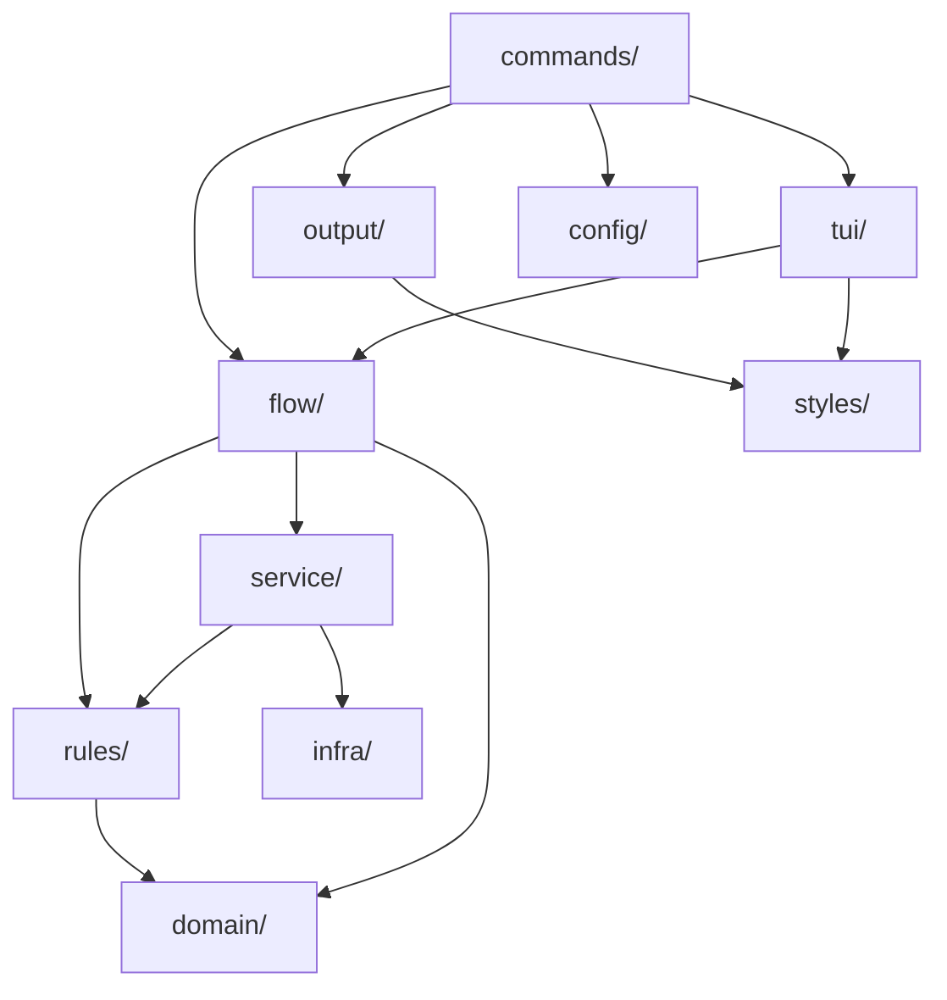

# Architecture — the layers and what they buy

wtm is a Cobra CLI with two interactive surfaces (an inline wizard and the `wtm ui`
dashboard) over one set of git operations. The layering exists so that a command's
*flow* — the order of its questions, its safety checks, its service calls — is
written once and can be replayed by either surface.

## The map

```
cmd/                          entry points, cobra setup only
internal/
  commands/                   flag wiring, delegates to flow/service (zero business logic)
    ui/                         `wtm ui`: refuses JSON and a missing TTY, hands off to tui/dashboard
  domain/                     types, errors, constants only (no methods, no functions)
  rules/                      pure functions (stdlib + domain only, no I/O)
  config/                     load & validate config.toml + run.toml
  flow/                       the flow of each command, surface-independent
    decide/                     branch/env decisions shared by the create-like flows
    create/                     `wtm create`: the run + its questions
    clean/                      `wtm clean`: the run + its questions
  service/                    impure orchestration (git exec, I/O, hooks)
  output/                     format and print results (zero decision logic)
  styles/                     all Lipgloss styles
  tui/                        Bubbletea models (rendering only)
    flowui/                     runs a flow.Session as the CLI wizard
    dashboard/                  `wtm ui`, the second surface over flow/
  infra/                      I/O, git exec, filesystem wrappers
```

## Who may call whom



Every arrow that is *missing* is the point:

| Interdiction | What it buys |
| -- | -- |
| `commands/` has no business logic | A command is readable as flags in, one call out. Changing the flow never means editing flag parsing. |
| `domain/` holds types, errors and constants only | Nothing can acquire a dependency by hiding behind a method on a shared type. |
| `rules/` imports only stdlib + `domain/` | Decisions stay testable with no repo, no network, no temp dir. `rules.DecidePush` is a table test, not an integration test. |
| `service/` never imports cobra, bubbletea or lipgloss | The git operations are callable from a test, a flow, a daemon — anything that is not a terminal. |
| `output/` and `tui/` hold no decision logic | Two surfaces can render the same run without disagreeing about what it means. |
| `styles/` is the only package instantiating `lipgloss.Style` | A theme change is one file. |
| `flow/` imports only `service/`, `rules/`, `domain/` and the stdlib | The flow cannot grow a dependency on the surface that runs it. This is what makes a second surface possible at all — see below. |

`flow/` cannot reach `infra/` either. When a flow needs something only `infra/` has,
the fix is a thin `service/` wrapper, not an exception: `worktree.FindByBranch` and
`worktree.ListAll` exist for exactly that reason.

The `flow/` import rule is checked mechanically by the `build-validator` subagent
(step 6) rather than left to review.

## The founding observation: seven closures

Before this layering existed, `internal/commands/wt/*.go` did three things at once:
read the flags, run the flow itself, **and** hand the TUI closures that called back into
the service. The TUI is forbidden from importing `service/`, so the command passed it
functions instead:

| Closure injected into the TUI | Command | What it called back into |
| -- | -- | -- |
| `SourceUpdate` | `create`, `extract` | `branch.Divergence` |
| `Target` | `create`, `extract` | `branch.Target` |
| `EnvFallback` | `create`, `extract` | `shared.EnvParentFallbackApplies` |
| `Check` | `clean` | `worktree.Check` |
| `ReparentPreview` | `clean` | `worktree.PlanCleanReparent` |
| `PlanPreview` | `sync` | `worktree.PlanSync` + `output.SprintSyncPlan` |
| `LoadFiles` | `extract` | `infra.ListModifiedFiles` |

The rule was respected and the architecture was still defeated: the service call
happened on the TUI's goroutine, at the TUI's whim, with the command as a courier.
Worse, the flow lived on both sides of that boundary — the dashboard could not
replay it without duplicating it.

`flow/` **is allowed** to call the service. Those closures become hooks carried by the
step declaration itself (`Skip`, `Build`, `Load`) and the courier disappears. That is
the gain that justifies the refactor independently of the dashboard: `create` and
`clean` inject nothing today.

The closures have not all gone yet, because not every command has migrated: `sync`
still injects `PlanPreview` into `internal/tui/syncpicker`, `checkout` still injects
`EnvFallback`. `prune`'s `ReparentPreview` went with its migration — a flow calls
`rules.FinalizePrunePlan` itself. And `internal/commands/wt/create.go` still holds `sourceUpdatePrompt`,
`envFallbackPrompt` and `memoizedTarget` as thin adapters over `internal/flow/decide` —
not for `create`, which no longer uses them, but for `wtm extract`, which embeds
create's Bubbletea wizard as a sub-flow. They go with its migration (LUC-182).

## What is migrated, and what is not

| Command | Flow lives in | Surfaces |
| -- | -- | -- |
| `create` | `internal/flow/create` | CLI wizard, unattended, dashboard |
| `clean` | `internal/flow/clean` | CLI wizard, unattended, dashboard |
| `reparent` | `internal/flow/reparent` | CLI wizard, unattended, dashboard |
| `prune` | `internal/flow/prune` | CLI wizard, unattended, dashboard |
| `extract`, `sync`, `relocate`, `checkout`, `env` | `internal/commands/wt/*.go` + their `internal/tui/*` wizard packages | CLI only |

Unmigrated commands still follow the old model, and the parts of the `go-cli` skill
that describe `components.Step` wizards still apply to them. A **new** mutation
command goes through `flow/` — see [adding-a-mutation-command.md](adding-a-mutation-command.md).
