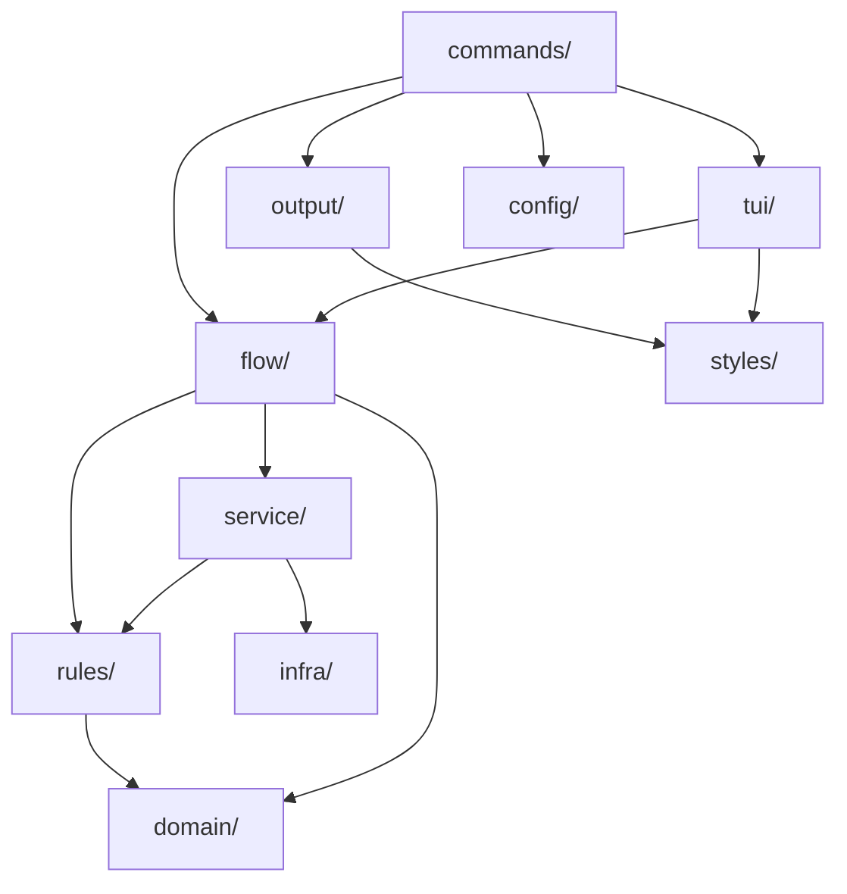

# Architecture — the layers and what they buy

wtm is a Cobra CLI with two interactive surfaces (an inline wizard and the `wtm ui`
dashboard) over one set of git operations. The layering exists so that a command's
*flow* — the order of its questions, its safety checks, its service calls — is
written once and can be replayed by either surface.

## The map

```
cmd/                          entry points, cobra setup only
internal/
  commands/                   flag wiring, delegates to flow/service (zero business logic)
    ui/                         `wtm ui`: refuses JSON and a missing TTY, hands off to tui/dashboard
  domain/                     types, errors, constants only (no methods, no functions)
  rules/                      pure functions (stdlib + domain only, no I/O)
  config/                     load & validate config.toml + run.toml
  flow/                       the flow of each command, surface-independent
    decide/                     branch/env decisions shared by the create-like flows
    create/                     `wtm create`: the run + its questions
    clean/                      `wtm clean`: the run + its questions
    runlogs/                    `wtm run`: the jobs, their live streams, the start sequence
  service/                    impure orchestration (git exec, I/O, hooks)
  output/                     format and print results (zero decision logic)
  styles/                     all Lipgloss styles
  tui/                        Bubbletea models (rendering only)
    flowui/                     runs a flow.Session as the CLI wizard
    dashboard/                  `wtm ui`, the second surface over flow/
    runview/                    `wtm run up`/`logs`, a VT emulator per job
  infra/                      I/O, git exec, filesystem wrappers
```

## Who may call whom



Every arrow that is *missing* is the point:

| Interdiction | What it buys |
| -- | -- |
| `commands/` has no business logic | A command is readable as flags in, one call out. Changing the flow never means editing flag parsing. |
| `domain/` holds types, errors and constants only | Nothing can acquire a dependency by hiding behind a method on a shared type. |
| `rules/` imports only stdlib + `domain/` | Decisions stay testable with no repo, no network, no temp dir. `rules.DecidePush` is a table test, not an integration test. |
| `service/` never imports cobra, bubbletea or lipgloss | The git operations are callable from a test, a flow, a daemon — anything that is not a terminal. |
| `output/` and `tui/` hold no decision logic | Two surfaces can render the same run without disagreeing about what it means. |
| `styles/` is the only package instantiating `lipgloss.Style` | A theme change is one file. |
| `flow/` imports only `service/`, `rules/`, `domain/` and the stdlib | The flow cannot grow a dependency on the surface that runs it. This is what makes a second surface possible at all — see below. |

`flow/` cannot reach `infra/` either. When a flow needs something only `infra/` has,
the fix is a thin `service/` wrapper, not an exception: `worktree.FindByBranch` and
`worktree.ListAll` exist for exactly that reason.

The `flow/` import rule is checked mechanically by the `build-validator` subagent
(step 6) rather than left to review.

## The founding observation: seven closures

Before this layering existed, `internal/commands/wt/*.go` did three things at once:
read the flags, run the flow itself, **and** hand the TUI closures that called back into
the service. The TUI is forbidden from importing `service/`, so the command passed it
functions instead:

| Closure injected into the TUI | Command | What it called back into |
| -- | -- | -- |
| `SourceUpdate` | `create`, `extract` | `branch.Divergence` |
| `Target` | `create`, `extract` | `branch.Target` |
| `EnvFallback` | `create`, `extract` | `shared.EnvParentFallbackApplies` |
| `Check` | `clean` | `worktree.Check` |
| `ReparentPreview` | `clean` | `worktree.PlanCleanReparent` |
| `PlanPreview` | `sync` | `worktree.PlanSync` + `output.SprintSyncPlan` |
| `LoadFiles` | `extract` | `infra.ListModifiedFiles` |

The rule was respected and the architecture was still defeated: the service call
happened on the TUI's goroutine, at the TUI's whim, with the command as a courier.
Worse, the flow lived on both sides of that boundary — the dashboard could not
replay it without duplicating it.

`flow/` **is allowed** to call the service. Those closures become hooks carried by the
step declaration itself (`Skip`, `Build`, `Load`) and the courier disappears. That is
the gain that justifies the refactor independently of the dashboard: `create` and
`clean` inject nothing today.

The closures have not all gone yet, because not every command has migrated:
`checkout` still injects `EnvFallback`. `prune`'s `ReparentPreview` and `sync`'s
`PlanPreview` both went with their migration — a flow calls `rules.FinalizePrunePlan`
and `rules.SprintSyncPlan` directly, and `internal/tui/syncpicker` (the package
`PlanPreview` was injected into) no longer exists. And `internal/commands/wt/create.go` still holds `sourceUpdatePrompt`,
`envFallbackPrompt` and `memoizedTarget` as thin adapters over `internal/flow/decide` —
not for `create`, which no longer uses them, but for `wtm extract`, which embeds
create's Bubbletea wizard as a sub-flow. They go with its migration (LUC-182).

## The run module — a flow that asks nothing

`internal/flow/runlogs` is the second shape a flow takes. `create` and `clean` ask
questions and need a `Prompter`; a run has none to ask — it *reports*. So the seam is
made of three types instead:

- **`runlogs.Session`** — the worktree's jobs as a surface reads them: `Jobs()` (a
  `JobView` per declared or running job), `Refresh()`, `Attach()` for a live `Stream`, and
  `History()` for what a job left in its log file. A surface never speaks to
  `service/process`.
- **`runlogs.Stream`** — one attached job: raw chunks in (escape sequences included, an
  emulator needs them untouched), keystrokes and a PTY resize out.
- **`runlogs.Run(ctx, RunParams)`** — a profile's start sequence, reporting each step to a
  `Sink` as an `Event`/`Phase`. It returns an `Outcome`, never an error: what a partial
  state is worth — an exit code, a report, a JSON entry — belongs to the surface.
  Cancelling `ctx` ends the *reporting*, not the jobs: that is what a detach is.

Three surfaces consume it, chosen by one pure rule (`rules.DecideRunSurface`, which needs
a terminal, a human format and no `-d` before it picks the view):

| Surface | Who | What it does with the seam |
| -- | -- | -- |
| `internal/tui/runview` | a terminal | full screen, one VT-emulated pane per job, tmux-style focus; returns its recap for the command to frame |
| `output.RunPrinter` | `-d`, a pipe, CI | renders each `Event` as a line on stdout/stderr |
| `output.WriteRunOutcomeJSON` | `--output json` | the array of job results, with the failing job's `output` and `exit_code` |

Everything a job needs to know about *which* worktree it belongs to is resolved by the
client and travels down the seam beside `WorkDir` and `LogDir`: `RunParams.Env` →
`StartRequest.Env` → `process.Request.Env` → `cmd.Env`. It cannot be inherited — the
daemon is global, outlives the command that forked it, and its own environment belongs to
whichever worktree happened to start it. `service/worktree.EnsureOrdinal` is what gives
the worktree the stable number those variables derive from, and
`service/worktree.JobEnv`/`BranchEnv` assemble them; the daemon keeps the resolved map on
the `ManagedJob` so the job's stop command runs in the same environment its start did.

`internal/commands/run/surface.go` is the whole wiring: open the seam, build the starter,
switch on the rule. The one thing left in the command is `handleConcurrentJobs` — the
question `run up` asks about another worktree's jobs. It is a `flow.Prompter` question in
everything but name, and `runlogs` has no Prompter; it stays put until the
`--exclusive`/`--parallel` axis is reopened, which worktree isolation may remove entirely.

## Worktree ports and the `.env` — a terminal transformation, not a source

Two modules meet on the `.env` files, and the order they meet in is the whole design.

`internal/service/env` reconciles a worktree's `.env` against a **cascade of value sources** — the parent worktree, then main, then the committed template. `internal/rules/jobports.go` resolves the **host ports** a worktree binds: the base declared in `run.toml` plus that worktree's offset. A `[[env_port]]` link says a `.env` key carries one of those ports, whether alone (`DB_PORT=5432`) or buried in a URL (`DATABASE_URL=postgres://…@localhost:5432/app`).

The tempting move is to make the resolved port a fourth value source. It is wrong, and expensively so. The sources all hold *another* worktree's port — main's, or the parent's — so in `EnvModeRefresh` the key lands in `EnvKeyConflict` between two spellings of the same setting, and `--on-conflict overwrite` dutifully restores main's port, undoing the isolation on every run.

So the port is applied **after** the merge, once, in `settleEnvPorts`, and the diff is taught to compare *modulo the offset*:

| Piece | Where | What it does |
| -- | -- | -- |
| `rules.PlanEnvPorts` | pure | resolves every link against the value on disk; only a base found **exactly once** is rewritten |
| `rules.ReduceEnvPortValue` | pure | rewinds any worktree's port to the base, so `5442` and `5432` compare equal |
| `rules.DiffEnv` (`PortBases`, `PortBlock`) | pure | the single comparison site, in `classifyKey.differ` |
| `env.ApplyEnvPorts` | service | the write, after every file is reconciled |

Two consequences worth keeping:

- **The reduction is modular, not subtractive.** Under the `parent` strategy the source value comes from another worktree whose offset the reader never learns, so `ReduceEnvPortValue` looks for *a number of the shape `base + k×block`* rather than for one known value. A value with no such number, or with two, is left alone — reducing on a guess would hide a real conflict.
- **Every match is bounded by digit boundaries.** Without them base `5432` matches inside `54321` and the substitution silently corrupts the value, which is the exact failure the feature exists to prevent.

The cross-file check has to live outside `config.LoadRun`: that loader only ever sees `run.toml` and validates what `run.toml` can answer for alone. Whether a link names a configured env target needs `.wtm.toml` too, so `rules.ValidateEnvPortTargets` is called where both are in hand — `service/worktree.ResolveEnvPorts`.

## What is migrated, and what is not

| Command | Flow lives in | Surfaces |
| -- | -- | -- |
| `create` | `internal/flow/create` | CLI wizard, unattended, dashboard |
| `clean` | `internal/flow/clean` | CLI wizard, unattended, dashboard |
| `reparent` | `internal/flow/reparent` | CLI wizard, unattended, dashboard |
| `prune` | `internal/flow/prune` | CLI wizard, unattended, dashboard |
| `sync` | `internal/flow/sync` | CLI wizard, unattended, dashboard |
| `extract`, `relocate`, `checkout`, `env` | `internal/commands/wt/*.go` + their `internal/tui/*` wizard packages | CLI only |

Unmigrated commands still follow the old model, and the parts of the `go-cli` skill
that describe `components.Step` wizards still apply to them. A **new** mutation
command goes through `flow/` — see [adding-a-mutation-command.md](adding-a-mutation-command.md).
