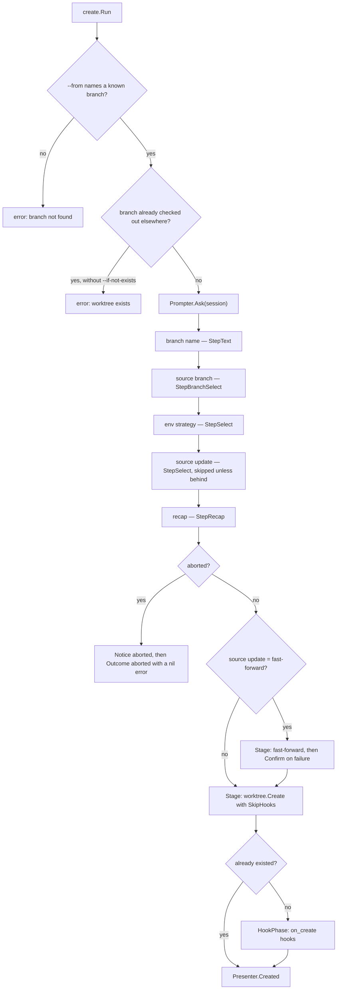
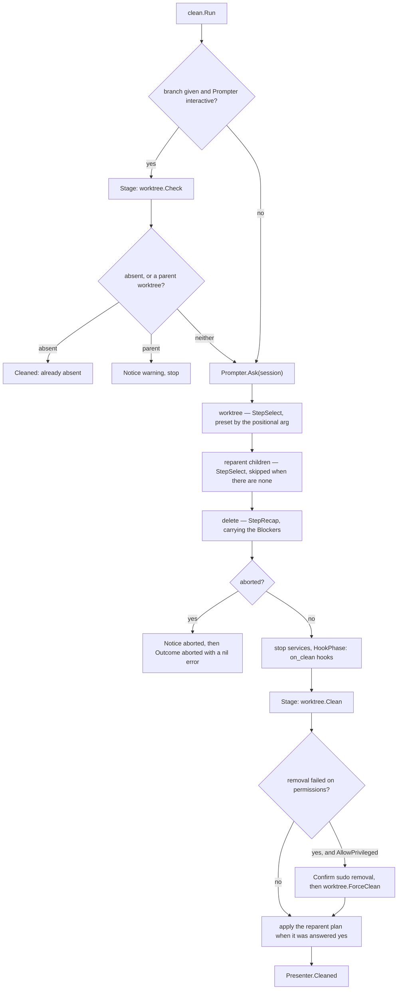
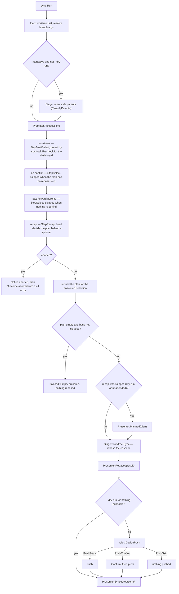
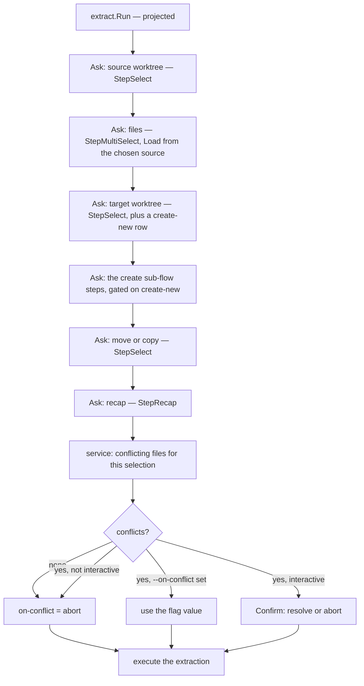
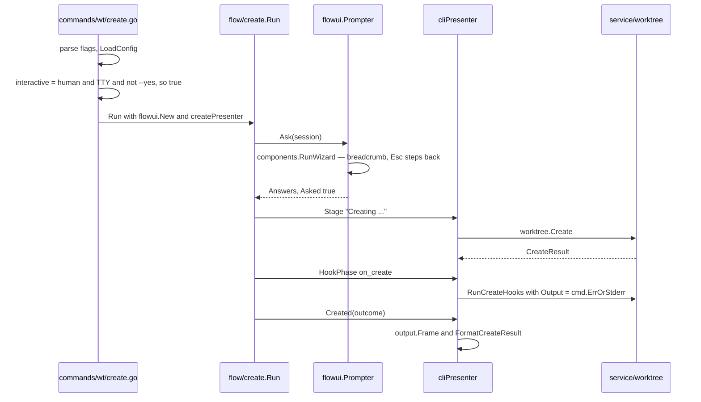
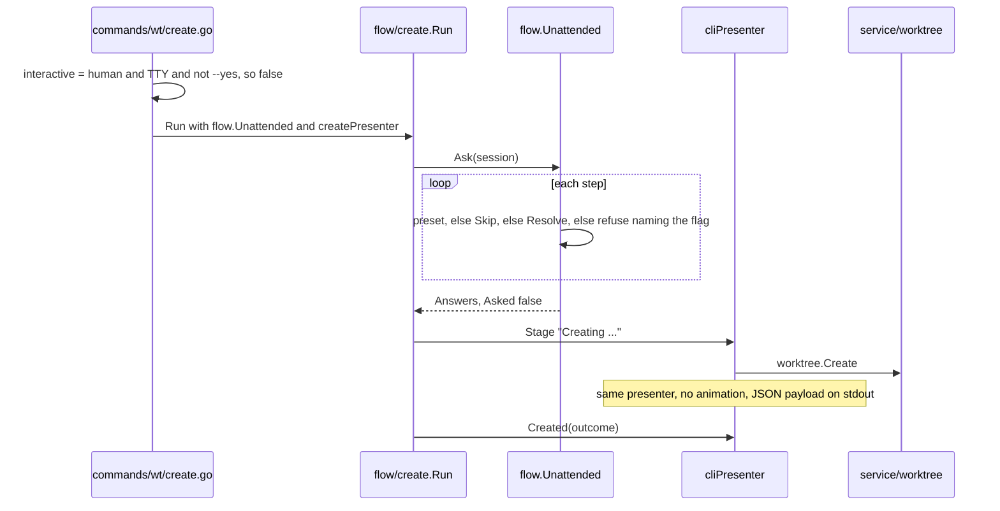
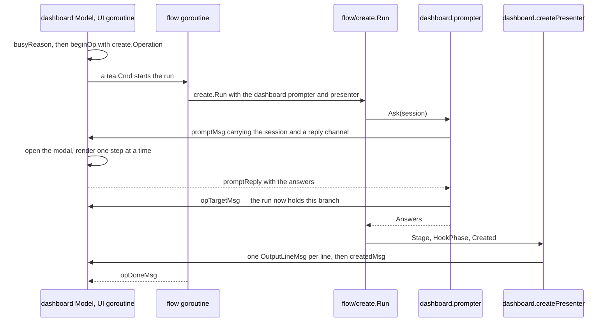
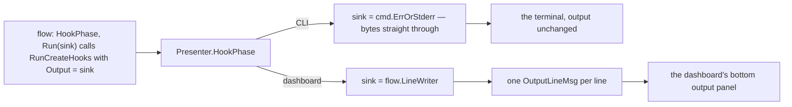

# `internal/flow/` — how a command runs

A *flow* is everything a command does between "the flags are parsed" and "the result
is printed": the questions it asks, in what order, which ones it may skip, the safety
checks, the service calls, the phases it reports. It is written once, in
`internal/flow/<command>/`, and three different surfaces can run it.

This document describes the code **as delivered**. Where it says *projected*, nothing
is implemented yet.

- [What is delivered today](#what-is-delivered-today)
- [The shape of a flow](#the-shape-of-a-flow)
- [The three seams](#the-three-seams)
- [The step model](#the-step-model)
- [Command flow diagrams](#command-flow-diagrams)
- [One flow, three surfaces](#one-flow-three-surfaces)
- [Unattended resolution and the two axes](#unattended-resolution-and-the-two-axes)
- [Hook output, from the service writer to the dashboard panel](#hook-output-from-the-service-writer-to-the-dashboard-panel)
- [Testing a flow](#testing-a-flow)
- [sync — the decisions this migration settled](#sync--the-decisions-this-migration-settled)
- [Known gaps](#known-gaps)

## What is delivered today

| | Status |
| -- | -- |
| `wtm create` | migrated — `internal/flow/create` |
| `wtm clean` | migrated — `internal/flow/clean` |
| `wtm reparent` | migrated — `internal/flow/reparent` |
| `wtm prune` | migrated — `internal/flow/prune` |
| `wtm sync` | migrated — `internal/flow/sync` |
| `wtm run up\|down\|start\|stop\|logs` | migrated — `internal/flow/run/<cmd>`, over the questions in `internal/flow/run/target` and the daemon binding in `internal/flow/run/seam` (LUC-193) |
| `wtm run ps` | not a flow: it reads the daemon's index and prints it, and asks nothing |
| `wtm run list` | migrated — `internal/flow/run/list` answers which entry was picked and what to do to it; `internal/commands/run/dispatch.go` runs that action through the flow it already has for it (LUC-217) |
| `wtm run job add\|edit\|rm\|list` | migrated — `internal/flow/run/job` (LUC-217) |
| `wtm run profile add\|edit\|rm\|list` | migrated — `internal/flow/run/profile` (LUC-217) |
| `wtm run open`, `wtm run url` | migrated — `internal/flow/run/open` and `internal/flow/run/url`, over `target.URLStep` and the address reader in `internal/flow/run/urls` (LUC-217) |
| CLI wizard surface | `internal/tui/flowui` |
| Unattended surface | `flow.Unattended` (in `internal/flow`) |
| Dashboard surface | `internal/tui/dashboard` (`prompter.go`, `presenter.go`, `ops.go`) |
| Test doubles | `internal/testutil/flowtest` |
| `extract` | **not migrated** — still driven by `internal/commands/wt` plus its wizard package (`internal/tui/extract`). The model was validated on paper against it; that is not the same as delivered. Tracked as LUC-182. |
| `checkout`, `relocate`, `env` | **not migrated** either, which nothing said until `archlint`'s `mutation` rule counted them: all three call their service straight from `internal/commands/`, so no second surface can run them. Listed in `.archlint-migrating`, reported on every `make lint`. |
| `StepMultiSelect` | exists since `reparent`, which needed it to keep its no-argument picker. Rendered by both surfaces: `flowui`, and the dashboard's modal since its Actions menu runs the batch reparent. Since `prune`, an `Option` can also arrive pre-checked and tagged (`Selected`, `Tag`, `Tone`). `Tone` is a `domain` enum, not a `flow` one, so `components.TagVariantOf` can hold the one mapping onto the palette without the widget library learning about `flow`. |
| `StepContent.Start` and `Option.Badges` | exist since the run module's worktree step (LUC-193), which opens its cursor on the worktree you are standing in and marks each row with what it is running. Both surfaces render them; `Badges` are the trailing words of a `StepSelect` row, where `Tag` is the leading one of a `StepMultiSelect` row. |
| `StepText` pre-fill | `StepContent.Default`, since the CRUD forms of `run job` and `run profile` (LUC-217). It is content rather than a static field because what a form opens on can depend on the answers before it. |
| `StepReorder` | asks for an order rather than a selection, since a profile's job list is its start order (LUC-217). Rendered by `flowui` and by the dashboard's modal. |
| `seam.Watcher` | the run flows' extra Presenter half. A start sequence cannot be reported through `Stage`: the surface has to be drawing before the first job is asked for, so the surface calls the sequence and hands back its `Outcome`. |

## The shape of a flow

One package per command, splitting the run from the questions it asks:

```
internal/flow/create/
  create.go   the run: Request, Outcome, Presenter, Params, Run, Operation
  steps.go    the session: the flow.Step declarations and the recap
```

The entry point is always the same shape — one struct parameter, one outcome, one
error:

```go
type Params struct {
	Context   flow.Context   // ProjectDir, StateDir, Config
	Request   Request        // what the surface already knows
	Prompter  flow.Prompter  // who answers the questions
	Presenter Presenter      // where the phases go
}

func Run(params Params) (Outcome, error)
```

`Run` is a package-level function per command (`create.Run`, `clean.Run`), not a
method on a shared type. Behind it, an unexported `createFlow` / `cleanFlow` struct
holds the params so the step declarations can close over them.

**Errors are returned, never presented.** `flow` has no `Presenter.Error`: on the CLI
Cobra prints the error and `rules.ExitCode` sets the exit status; on the dashboard the
caller puts it in the output panel. A user abort is different — it is a `Notice`
followed by `Outcome{Aborted: true}` and a `nil` error, because the user cancelling is
not a failure.

## The three seams

### `flow.Prompter` — who answers

```go
type Prompter interface {
	Ask(Session) (Answers, error)
	Confirm(ConfirmParams) (bool, error)
	Interactive() bool
}
```

- **`Ask`** runs a whole question-and-recap sequence and returns every answer, keyed
  by `Step.Key`. It returns `domain.ErrUserAborted` when the user backs out.
- **`Confirm`** is a standalone decision that can only exist *after* an execution —
  a fast-forward that failed, a removal that needs `sudo`. There is no session left to
  join at that point.
- **`Interactive`** reports whether a decision may be offered at all. It is read for
  exactly two purposes: not offering a decision nobody can answer, and feeding a pure
  rule that takes it as an input (`rules.DecidePush`). Any other use puts the bypass
  taxonomy back into the commands, which is what this layer removes.

```go
type Session struct {
	ErrLabel string   // what the host calls the command if a step errors
	Steps    []Step
	Presets  Answers  // values the request already carries
}
```

Three implementations:

| Implementation | Where | `Ask` | `Confirm` | `Interactive()` |
| -- | -- | -- | -- | -- |
| `flowui.Prompter` | `internal/tui/flowui` | `components.RunWizard` | `components.RunStandaloneConfirm` | `true` |
| `flow.Unattended` | `internal/flow/unattended.go` | resolves with no interaction | `false, nil` | `false` |
| `dashboard.prompter` | `internal/tui/dashboard` | a modal, over a channel | a one-question modal | `true` |

`Unattended` lives in `flow/` on purpose: it is the only implementation with no
surface dependency, and it carries the bypass taxonomy — which must exist once, not
once per surface.

### `flow.Presenter` — where the phases go

```go
type Presenter interface {
	Stage(StageParams) error         // one unit of work under a progress indicator
	HookPhase(HookPhaseParams) error // a titled hook section + the sink hooks stream into
	Notice(Notice)                   // concludes the run
	Status(Notice)                   // one line inside an ongoing phase
}
```

A flow never frames, never animates and never picks a stream — it says *what phase
this is*, the surface decides how it reads. `Notice` carries a `NoticeKind`
(`NoticeMessage`, `NoticeWarning`, `NoticeSuccess`); `flow.AbortedNotice` is the
shared "Aborted." value.

The conclusion is **typed per command**, not generic, so `flow/` never has to decide
on a format:

```go
// internal/flow/create
type Presenter interface {
	flow.Presenter
	Created(Outcome) error
}

// internal/flow/clean
type Presenter interface {
	flow.Presenter
	Cleaned(Outcome) error
}
```

The outcome carries data (`domain.CreateResult`, the reparent results, the path), never
text. The CLI turns it into `output.FormatCreateResult` or a JSON payload; the
dashboard turns it into a line in the output panel plus a refresh message.

It is both an event and a return value, and that is not indecision: a conclusion has to
be *emitted during* the run for a flow whose recap must appear before a later prompt,
and the caller needs the *value* for the JSON payload and the exit code.

### `Request` — what the surface already knows

The request is declared by the command's flow package, not by `flow/`:

```go
// internal/flow/create
type Request struct {
	Branch      string // positional arg
	From        string // --from
	EnvFrom     string // --env-from
	FastForward bool   // --ff
	IfNotExists bool   // --if-not-exists
}

// internal/flow/clean
type Request struct {
	Branch           string
	Force            bool // the safety axis
	ReparentChildren bool
	BaseBranch       string
	AllowPrivileged  bool // may this surface hand the terminal to sudo?
}
```

It holds **no `--yes` and no `--output`**. The confirmation axis is the Prompter that
was installed; the output format is the surface's business. `--force` *does* belong
there: it is the safety axis, a business input the service consumes
(`domain.CleanParams.Force`), not a dialogue capability.

`AllowPrivileged` is the same idea applied to a surface capability: the CLI owns the
terminal it prompts on, so it can hand it to `sudo`; the dashboard is holding that
terminal in alt-screen, so it sets `false` and names the way out instead.

## The step model

```go
type Step struct {
	Kind        StepKind // StepText | StepSelect | StepBranchSelect | StepRecap
	Key         string   // identifies the answer in Answers
	Label       string   // the step's name in the breadcrumb / summaries
	Title       string
	Description string
	Options     []Option

	Branches []domain.BranchCandidate // StepBranchSelect only
	Pinned   string
	Refresh  func() []domain.BranchCandidate

	Validate       func(value string) error
	Skip           func(Answers) (skip bool, reason string)
	Build          func(Answers) (StepContent, error) // re-derive content, synchronously
	Load           func(Answers) (StepContent, error) // same, but it does I/O
	LoadingMessage string

	Resolve   func(Answers) (Answer, error) // the whole bypass taxonomy, see below
	Summarize func(Answer) string
	Flag      string
	Arg       bool
}
```

`Flag` and `Arg` are the two halves of one thing: what an unattended run should
have passed. A step answered by a flag names it, a step answered by a positional
says so, and `requiredErr` words the refusal accordingly — naming a `--job` that
a command does not have sends the reader looking for it.

**A kind that is drawn must be read back.** `flowui`'s `answerOf` and the
dashboard's modal each cross the model-per-kind switch once; a kind added to one
and not the other answers empty, and the flow writes that absence as if it were
the answer. `TestEveryDrawableKindIsReadBack` pins it.

`StepContent` is the part that may depend on earlier answers — `Title`, `Description`,
`Options`, and `Blockers`.

```go
// Blocker is one safety refusal standing in the way of the step's dangerous
// option, stated on its own so nothing is ever lifted implicitly.
type Blocker struct {
	Key   string
	Label string
}
```

Blockers are why the dashboard can offer a per-refusal acknowledgement where the CLI
prints a list: `rules.CleanBlockers` produces them, `internal/flow/clean/steps.go`
attaches them to the delete step, and the dashboard renders each as a checkbox that
must be ticked before the dangerous option becomes submittable. Folding them into the
prose would have made that impossible.

Answers are immutable and typed — no `any` anywhere:

```go
type Answer struct {
	Value      string
	Skipped    bool
	SkipReason string
	Asked      bool // false for a preset, a Resolve fallback, or a skip
}

func NewAnswers(values map[string]string) Answers        // "" means unanswered
func (a Answers) With(key string, answer Answer) Answers // returns a copy
func (a Answers) Get(key string) (Answer, bool)
func (a Answers) Value(key string) string
func (a Answers) Answered(key string) bool // asked, and not skipped
```

`Presets` is what keeps a flag from erasing a recap line: a preset step is **not
asked**, but it is still read back by the recap builder, so `wtm create feat/x --from
main` shows the same three lines as the fully interactive run. `Answered` is the
converse — it tells a flow whether a human actually saw a question, which is how a
recap that was auto-confirmed stays distinguishable from one that was reviewed.

### `flow.Operation` — how a flow is scheduled

```go
type Operation struct {
	Kind      string // domain.OpKindCreate, domain.OpKindClean
	Mode      Mode   // ModeBlocking | ModeBackground
	TargetKey string // the answer naming the worktree this run holds
}
```

This is what a flow declares about *how it is scheduled*, for a surface that runs
several at once. `Mode` says how long it holds that surface: `ModeBlocking` (`clean`,
which destroys its target) keeps it until the run ends; `ModeBackground` (`create`,
whose hooks can run long) gives it back and locks its target instead. `TargetKey`
names the answer carrying that target — known only once the step is answered, which is
why the dashboard's prompter posts an `opTargetMsg` as soon as the session returns.

The CLI ignores all of it: one run, one terminal. `internal/tui/dashboard/ops.go` is
where it is enforced, once, instead of at every action site.

Two things the run flows made necessary there, both invisible while a run held one
worktree (LUC-218). The answers a `run` session hands back are **paths** — the
daemon's half of a job's key — where every reader of an operation (the row, the
refusal, the detail) speaks **branches**: the translation happens once, on receipt of
`opTargetMsg` (`rules.BranchesForPaths`), and a worktree git cannot name keeps its
path rather than losing its lock. And an operation holds a **stage per worktree**
(`operation.stages`, posted with the worktree the event came from): one string per
operation showed the last event received on every row it held, whichever worktree it
came from.

## Command flow diagrams

### `wtm create` (delivered)



The create flow calls `worktree.Create` with `SkipHooks: true` and runs the hooks as
its own phase afterwards, so the hook output does not fight the creation progress
indicator for the terminal.

### `wtm clean` (delivered)



`force` for the service call is `request.Force || answers.Value(KeyDelete) == "force"`:
the flag lifts the refusals up front, or the user lifts them in the recap by choosing
the dangerous option. Both routes converge on one value.

### `wtm sync` (delivered)



`sync` is why the conclusion is a Presenter method and not only a return value: its
recap must be shown *before* the push prompt, and an unattended or `--dry-run` run
never reaches the recap at all — `Planned` is what prints the plan on those two paths,
reproducing the pre-migration double output path (recap vs. `FrameStart` on stderr)
without a branch anywhere reading "am I unattended".

### `wtm extract` — projected, not delivered

`extract` does not run on `flow/` yet; it still drives `internal/tui/extract` from
`internal/commands/wt`. The model was validated on paper against it before the layer
was written, and the diagram below is that validation — what the migration is expected
to look like, not what runs. It is tracked by **LUC-182**, and it is the migration that
removes the temporary duplication of create's step declarations (they exist twice
today: as `flow.Step` for `wtm create`, and as `components.Step` in
`internal/tui/newwt` for the sub-flow `extract` embeds).



The on-conflict decision stays *outside* the session on purpose: the conflict list
depends on the selection **and** on the state of the disk, so it can only be asked
after the recap — a post-execution `Confirm`, like create's failed fast-forward.

## One flow, three surfaces

The same `create.Run` call, on the three surfaces. Only the two seams change.

### CLI, interactive



### CLI, unattended — `--yes`, no TTY, or `--output json`



Nothing about the flow changes — no branch anywhere in `create.Run` reads "am I
unattended". The only decision the command makes is *which Prompter to install*.

### Dashboard



Two things make this safe rather than merely possible: the flow runs on **its own
goroutine**, and every single thing it produces reaches the model as a `tea.Msg` on the
dashboard's channel. The prompter blocks on a reply channel — from the flow's
perspective `Ask` is an ordinary blocking call — while the UI goroutine keeps
rendering.

## Unattended resolution and the two axes

`flow.Unattended.Ask` is the entire bypass taxonomy, in one loop:

```go
func (Unattended) Ask(session Session) (Answers, error) {
	answers := session.Presets
	for _, step := range session.Steps {
		if _, known := answers.Get(step.Key); known {
			continue // the flag or the positional arg already answered it
		}
		if step.Skip != nil {
			if skip, reason := step.Skip(answers); skip {
				answers = answers.With(step.Key, Answer{Skipped: true, SkipReason: reason})
				continue
			}
		}
		if step.Resolve == nil {
			return Answers{}, requiredErr(step) // interactive-only: refuse, naming the flag
		}
		answer, err := step.Resolve(answers)
		if err != nil {
			return Answers{}, err
		}
		answers = answers.With(step.Key, answer)
	}
	return answers, nil
}
```

`Resolve` is where the three documented cases live, declared **on the step**, next to
the question they answer:

| Case | How the step declares it | Example |
| -- | -- | -- |
| 1. Decision or confirmation with a safe default | `Resolve` returns an `Answer` | create's env step returns `""` (the config default); create's source-update step returns `ff` only when `--ff` was passed, else `keep`; clean's reparent step returns `orphan`; every recap returns its confirm value |
| 2. Required selection with no safe default | `Resolve` returns an **error naming the flag** | create's source step refuses to guess the parent of a pre-existing branch and says to pass `--from`; clean's worktree step returns `domain.ErrCleanBranchRequired` |
| 3. Interactive-only | **no `Resolve` at all** | `Unattended` refuses with `requiredErr(step)`, built from `step.Label` and `step.Flag`. It never falls back to a picker — it cannot even open one |

The default a `Resolve` returns is never destructive. That is a rule, not an
observation: `clean --yes` leaves children orphaned unless `--reparent-children`,
`sync --yes` does not push.

**`--force` never travels this path.** It is not an answer, it is a field of the
`Request` — the safety axis. Two consequences worth keeping in mind:

- `--force` alone does **not** imply `--yes`. The session still runs and still asks to
  confirm; the refusals are simply already lifted.
- `--yes` alone does **not** lift a refusal. `clean --yes` on a dirty worktree fails,
  naming `--force`: see `resolveDelete` in `internal/flow/clean/steps.go`, which runs
  the safety check *while* answering the step.

The command's only job on this axis is choosing the Prompter, in one line:

```go
interactive := rules.IsHumanFormat(format) && !yes && term.IsTerminal(int(os.Stdin.Fd()))
// ...
Prompter: flowPrompter(flowPrompterParams{Interactive: interactive}),
```

## Hook output, from the service writer to the dashboard panel

`hooks.RunHooks` sets `cmd.Stdout = output` on each hook, so hook stdout is already
incremental at the source. What the flow layer adds is a way for a surface to receive
it as *events* rather than as a stream.



The flow never writes: it asks the Presenter for a sink and hands that sink to the
service. `flow.LineWriter` is an `io.Writer` that buffers the current fragment and
emits on each `\n`, with a `Flush` for the trailing partial line. It lives in `flow/`
because it depends on nothing but the stdlib.

**The concurrency point.** `RunHooks` is synchronous and writes from the calling
goroutine. So the dashboard runs the flow in a goroutine, and `LineWriter.Emit` posts a
`tea.Msg` on the dashboard's channel — it never mutates a model. This is the whole
reason `presenter.HookPhase` reads the way it does:

```go
func (p presenter) HookPhase(params flow.HookPhaseParams) error {
	p.line(params.Title)
	sink := &flow.LineWriter{Emit: p.line} // p.line sends a tea.Msg
	err := params.Run(sink)
	sink.Flush()
	return err
}
```

`LineWriter` is not concurrency-safe, and does not need to be: one hook run, one
writer, one goroutine.

What stays buffered on purpose is each hook's **stderr** — it is only printed when the
hook fails, under the `✗` line. Streaming it would change how CLI output interleaves.

## Testing a flow

A flow is tested without a terminal, by handing it the two doubles in
`internal/testutil/flowtest`:

```go
prompter := &flowtest.ScriptedPrompter{Answers: map[string]string{
	create.KeyBranch: "feat/x",
	create.KeySource: "main",
}}
recorder := &flowtest.Recorder{}
```

- **`ScriptedPrompter`** walks the session the way a real host does — honoring `Skip`,
  `Build` and `Load` — and answers each step from the script. It records `Asked` (with
  `AskedKeys()` for a one-line assertion) and the `StepContent` each step produced, so
  a test can assert on *what the user would have seen*, not only on the outcome. A step
  with nothing scripted is an error, so a new question cannot slip into a flow
  unnoticed.
- **`Recorder`** implements `flow.Presenter`, collecting `Stages`, `Hooks`, `Notices`
  and `Statuses`. It runs `Work()` and `Run(sink)` for real, so the service still gets
  called.

The typed conclusion (`Created`, `Cleaned`) is not part of `Recorder` — a test that
needs it embeds the recorder and adds the one method:

```go
type recorder struct {
	*flowtest.Recorder
	outcome create.Outcome
}

func (r *recorder) Created(o create.Outcome) error { r.outcome = o; return nil }
```

For the unattended path, `flow.Unattended{}` **is** the test double: passing it
directly is how the resolution taxonomy is tested (`internal/flow/unattended_test.go`).

**Characterization tests.** Before `create` and `clean` were migrated, their observable
CLI behavior was pinned by tests written against the *old* code:
`internal/tui/newwt/create_flow_test.go`, `internal/commands/wt/create_wizard_test.go`,
`create_noninteractive_test.go` and `integration_test.go` (the `--yes` / `--force` axes,
the JSON reparent default, idempotence on an absent worktree). `prune` got the same
treatment in `internal/commands/wt/prune_test.go`, which needed two new fixtures to
reach its core at all: `internal/testutil/ghtest` scripts the GitHub CLI through `PATH`,
and `gittest.AddOrigin` gives branches a real upstream. They exist to be run
unchanged after the refactor. Keep them that way: they are the only thing that proves a
flow that moved packages still reads the same to a user. When you migrate a command,
write its characterization tests first, and do not "fix" one to make a refactor pass.

## Two decisions worth not re-opening

### A non-mutating mode is a business input (`prune --dry-run`)

`--dry-run` looks like an output mode, and the first instinct is to keep it out of the
`Request` on the grounds that a request carries business inputs, not presentation. That
reading is wrong: `--dry-run` does not change *how the run reads*, it changes *what the
run does* — nothing. It belongs with `--force` on the input side, the way `terraform
plan` sits beside `apply`.

So `prune.Request.DryRun` exists, and `Run` returns an `Outcome` carrying the plan
before it asks a single question and before it touches anything. The alternative — a
second exported `Plan()` the runner calls instead of `Run()` — would have kept a plan
computation path in `commands/` and forced the `gh` advisory to be emitted from two
places.

`--force` is OR'd with the recap's own answer (`request.Force || answer == confirmForce`),
which is a deliberate change from the pre-`flow` `prune`: it read force from the picker's
answer alone, so `wtm prune --force` on a TTY followed by a plain "Yes, prune" dropped the
unsafe worktrees again. The two-axis model says otherwise — `--force` lifts the refusals
and is not re-asked — and `clean` already behaved this way. Pinned by
`TestForceSurvivesAPlainConfirmation`.

One trap comes with it, and it is why `rules.PruneClassifyForce` takes `DryRun` as an
input rather than being a `||` in the flow. A surface may perfectly well install an
interactive Prompter *and* set `DryRun`. Classifying with force because "someone could
uncheck" would then make a preview list worktrees a real run would have skipped. The
rule states the three-term condition once, and tests it.

### The three reparent service functions stay three

`worktree.ReparentBatch` (for `wtm reparent`), `worktree.ApplyReparentChildren` (for
`clean`) and `worktree.ApplyReparents` (for `prune`) all rewrite a worktree's recorded
parent. `prune` being the last of the three callers to migrate, the question of folding
them into one was raised deliberately here — and answered: **no.**

- There is **no duplicated logic to remove.** All three funnel into `setSourceBranch`,
  which is already the single chokepoint for the write.
- Their contracts genuinely differ. Only `ReparentBatch` validates acyclicity, because
  only it moves worktrees onto a parent the user chose. The other two reattach children
  to a grandparent, which cannot close a cycle by construction — giving them the check
  would be dead validation.
- Merging them yields one function with behaviour flags (`Validate bool`,
  `Grandparent bool`) that is harder to read than the three signatures it replaces, and
  hides which caller is allowed to skip which check.

What is broad is the *exported surface*, not the logic. Three names for one idea is a
fair price for three honest contracts. Do not consolidate them without a new reason.

## sync — what this migration settled

### `--keep-conflict` from the dashboard: offered, and the exit named

The dashboard poses the on-conflict step exactly as the CLI does: the decision stays
the user's, and the dashboard hides none of the options the CLI exposes. In return,
when a conflict is kept, the output panel names — per branch — the worktree path and
the `git rebase --continue` / `--abort` to run there
(`domain.SyncKeepConflictHintFmt`). Same gesture as `DashboardPrivilegedHintFmt` for a
privileged removal: the surface cannot finish the job, so it says where to finish it.

Not offering the option was rejected — it amputates something the CLI exposes and
sends the user back to a terminal to re-run the whole cascade. Exiting the dashboard
on a conflict was rejected too: it needs a shell integration the dashboard does not
have, and throws the user out of a surface they just opened, for the one outcome where
reading the hint matters most.

Accepted limit: `ModeBlocking` protects a worktree for the duration of the run only.
Nothing stops another operation from touching one left mid-rebase afterwards — the
`⟳ rebasing` badge, not a lock, is what surfaces it.

### What the dashboard pre-checks

`Branches`/`All` *fix* the selection, so the step becomes a preset the recap still
reads back. `Precheck` only says which boxes arrive **checked** when the step is
asked. The CLI never passes it — its picker opens empty, as `syncpicker` did — and
only the dashboard entries populate it.

`Sync this worktree` pre-checks the row's **ancestry**, base included
(`rules.SyncAncestry`), not its subtree. A worktree is rebased onto its parent, so
replaying one whose parent nobody refreshed lands it on a stale ref — the very problem
the `Parent branches` question exists to rescue after the fact. Pre-checking the chain
removes it instead of asking about it. Descendants are left out: dragging them in
makes the same entry mean one worktree from a leaf and four from a root, an asymmetry
no label lets you predict.

The run module's batch entries (`Start profiles`, `Stop worktrees`, `View logs`) split
it the same way: a **start** is about where you are, so it passes no precheck at all —
`target.WorktreesStep` already opens with the current worktree ticked — while a
**stop** and a **view** are about what is standing, and pass the worktrees the board
holds something up in (`rules.RunningWorktreeDirs`). `Stop worktrees` is also the one
place `run down` asks anything: from a row there is nothing to ask, stopping everything
there being the safe default, and from the global menu there is no row to answer for it.

`Sync worktrees` (`⋯ Actions`) pre-checks everything except `dirty` and `rebasing`
worktrees, which stay listed and tagged, one keystroke from being included — a
deliberate divergence from `--all`, which excludes nothing, and the same
explicit-vs-batch logic `prune` established. It is named `Sync worktrees` rather than
`Sync all worktrees` because it opens a selection; a label promising "all" reads as a
sweep with no way out. `--dry-run` gets no entry, as in `prune`: the recap **is** the
plan and closing the modal rebases nothing, so every dashboard sync gesture is already
a preview until it is confirmed.

### The no-terminal refusal

Human output, no TTY, neither `--yes` nor `--dry-run` → refuse, naming `--yes`
(`domain.SyncNeedsTerminal`), aligned with `prune`. It is one of the migration's **two**
CLI-observable behavior changes (the other is the plan header, below), and it closes a
real gap rather than tidying one: before it, `wtm sync feat-a | cat` launched a TUI
confirm on a non-TTY and the failure *was* the safety net — no confirm, nothing ran.
`flow.Unattended` has no such accident to fall back on, so without the guard that path
would have **mutated** where it used to abort.

The second is the cascade preview's header, now the constant `domain.SyncPlanHeader`
("Sync plan"): it no longer gains and loses a `(base: x)` suffix depending on whether
the cascade happens to touch the base. A header that comes and goes reads as two
different sections to whoever meets it twice, and the plan's own lines already name
every branch involved. It reaches the user through `Planned` — on stderr, where the
plan has always been written — on every run that saw no recap: `--dry-run`, `--yes`,
or no TTY.

One nuance keeps the condition from being a copy of `prune`'s: `sync`'s `interactive`
deliberately omits `!dryRun`, because `--dry-run` on a TTY still needs the picker to
choose *what* to preview. The refusal clause itself is identical.

Two picker renderings changed with no test to catch them, the frozen characterization
tests all running without a TTY: `dirty`/`rebasing` worktrees carry a
`flow.Option{Tag, Tone}` badge instead of a `" (dirty)"` label suffix, so both surfaces
read one step vocabulary; and the on-conflict question is skipped when the plan holds
no rebase step, instead of asking about a situation that cannot occur.

## Known gaps

Deliberately open, tracked, and not to be fixed opportunistically:

| Ticket | Gap |
| -- | -- |
| LUC-179 | `clean --force` alone without a TTY skips the safety check — pre-existing, made visible by this design |
| LUC-180 | `flow.Context` duplicates `shared.ConfigResult` (the latter imports cobra, so it cannot be reused as is) |
| LUC-182 | `extract` is not migrated; create's step declaration therefore exists twice |
| — | `internal/flow/run/job` and `internal/flow/run/profile` are the same four entry points over two unrelated config types, so their `Add`/`Edit`/`Remove`/`List` shells read as clones. Sharing them would mean generics over `JobConfig`/`ProfileConfig` for no reader's benefit |
| LUC-183 | `flow.Step` carries kind-specific fields (`Branches`, `Pinned`, `Refresh`, `Validate`/`ValidateSet`) on every kind. It also means a `StepBranchSelect` reads its candidates from `Step.Branches`, before any answer exists, so it cannot narrow them from an earlier step — `reparent` narrows from what its request already names instead |
| LUC-184 | Locked worktrees are only taken into account by `relocate`, so "locked" is not among clean's blockers |
| LUC-188 | `busyReason("")` only sees blocking runs, so a `ModeBackground` run holding a worktree does not stop a `ModeBlocking` run with no target (the batch reparent, `prune`) from acting on it |
| — | When every prune match is skipped, the run reports an empty result instead of the skips that explain it. Pinned by `TestPruneAllUnsafeReportsNothing` so a refactor cannot change it silently; fixing it is its own decision |
